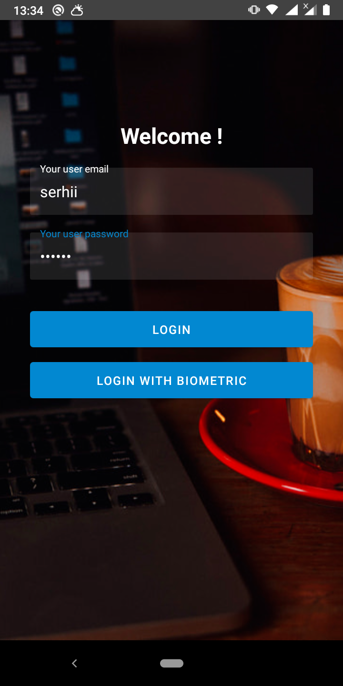
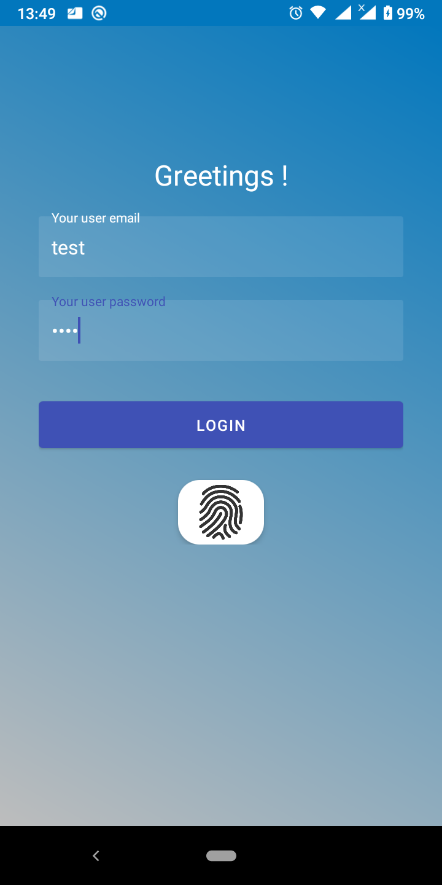
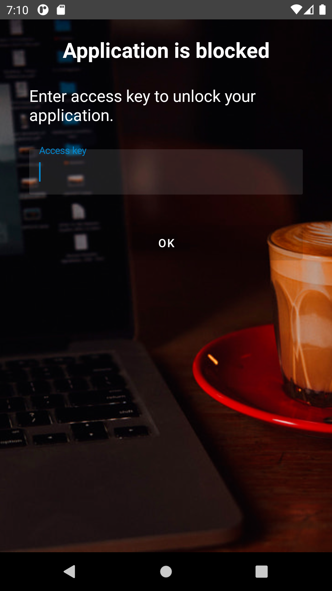
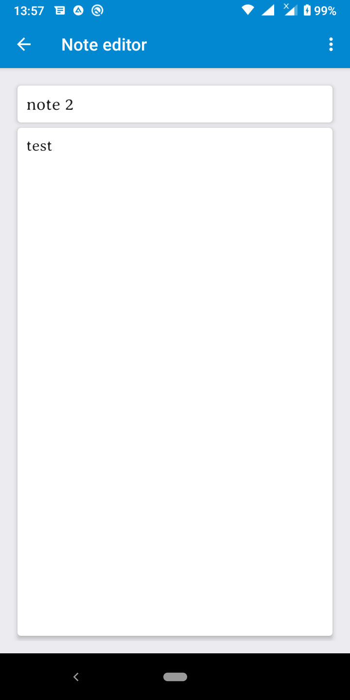
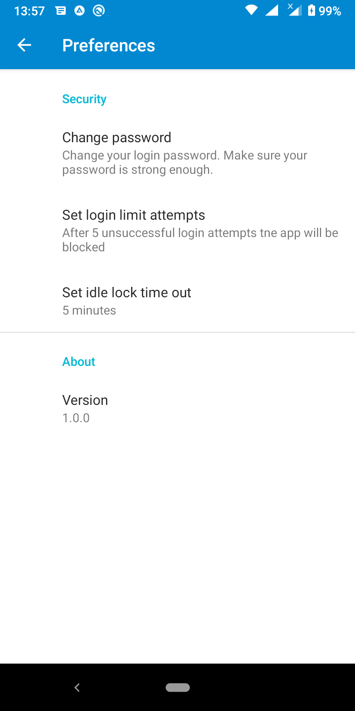

# Notes

# Overview

The app is developed for keeping all your notes in one place (passwords, plannings, film lists ets). Notes are saved encrypted in app database.
It provides simple interface and pleasant design.

# Features

- Password and biometric authentication
- Basic editing
- Login password limitation
- Idle Lock
- Apllication bloc
- User authentication enforcement for key use

# Implementation details

- Separated UI logic to fragments
- Separated presentation and bisness logic with MVVM pattern
- Separeted code into android/native libraries and modules
- Low level logic is written in native code -> improves code structure and code flexibility
- Java and native calls are made from a single place -> improves code maintainability
- Applided decouple strategies to separate a receiver and handler of an event/request
- Separated code into logical levels of abstraction

# Repo directory structure

- external-libs/ - reusable components
- Notes/ - application root directory

# Used technologies

- Languages: Java/JNI, C++17
- External native libraryies: OpenSSL, Boost
- Android framework features: androidX, view's bindings, fragments, key store, SQL database, biomatric API  

# Screenshots

 
  

