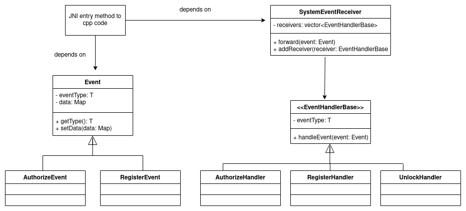

# Notes

# Overview

The app is developed for easily keeping and accessing all your information from the one place (passwords, plannings, everyday notes ets). 
Notes are saved encrypted in the app database. So, it couldn't be extracted and read easily, even if you lost your device.
Moreover, it provides simple interface and pleasant design for everyday usage.

# Features

- Password and biometric authentication
- Basic editing
- Login password limitation
- Idle lock
- Apllication block when the login password limit is expired
- Secure information storage and access 

# New features to implement

- Support for notes dictation using microphone
- Separate plans managing with notifications about time and day
- Back up support
- Application unblock support (currently there is no way to unlock the application) 
- Support for tables

# Implementation details

- Some part of application is written in C++ with single entry point
- Separated presentation and bisness logic with MVVM pattern

# Repository structure

- external-libs/ - reusable components
- Notes/ - root directory
- Notes/app/src/main/cpp - native code

# Used technologies

- Languages: Java/JNI, C++17
- External native libraryies: OpenSSL, Boost
- Android: androidX, view's bindings, fragments, key store, SQL database, biometric APIs, LiveData and ViewModel  

# Screenshots

 
  
 

# UML class diagram

Skeleton of implemented sender/received mechanism of an event handling model between Java and native code

