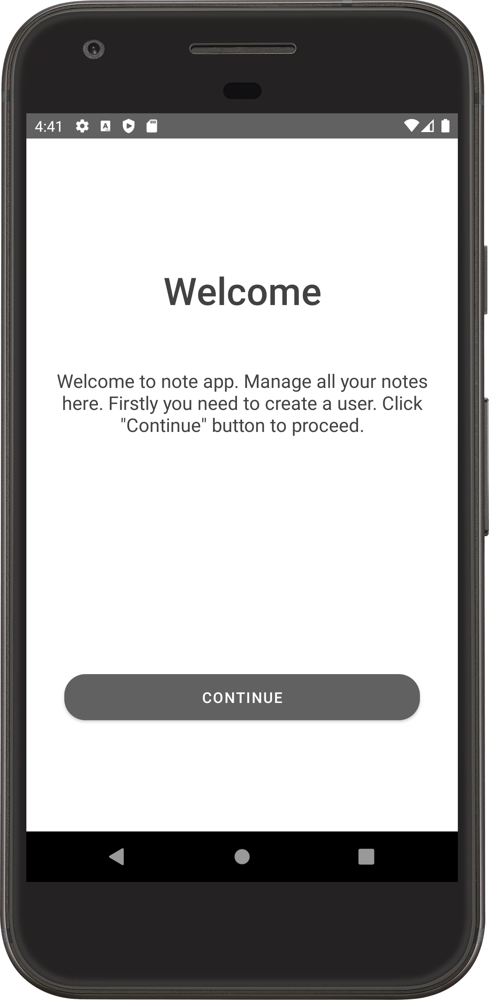
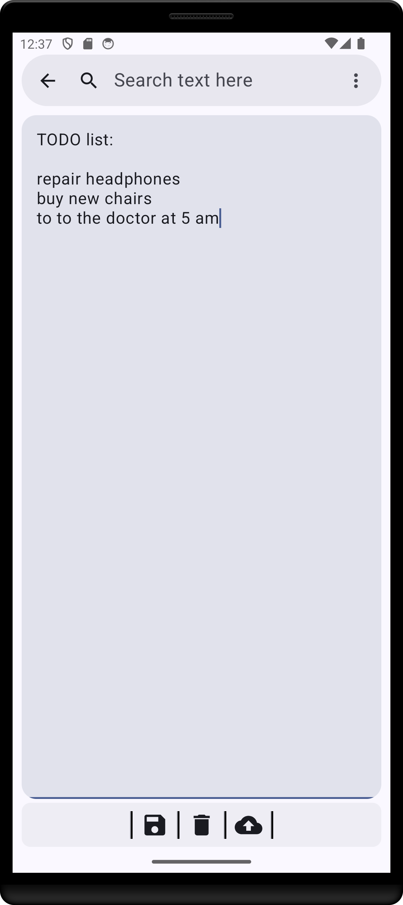
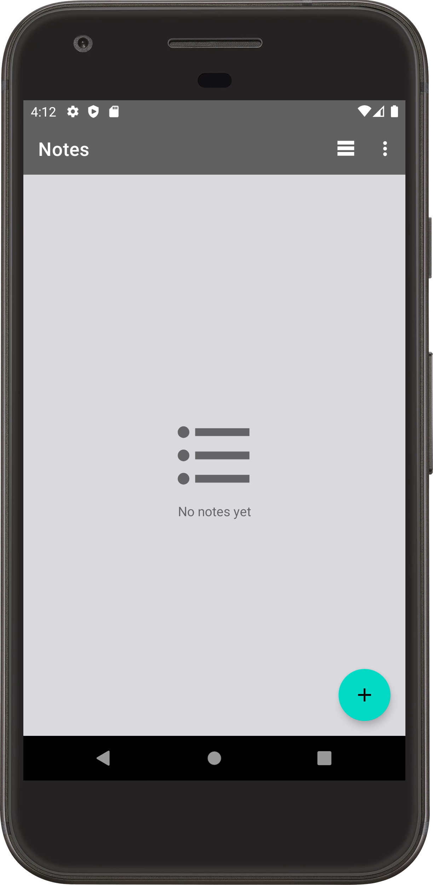
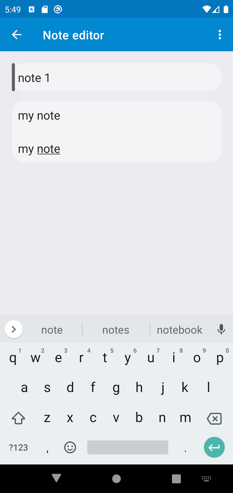
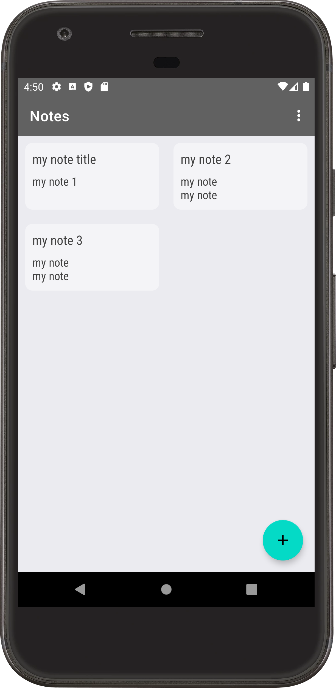
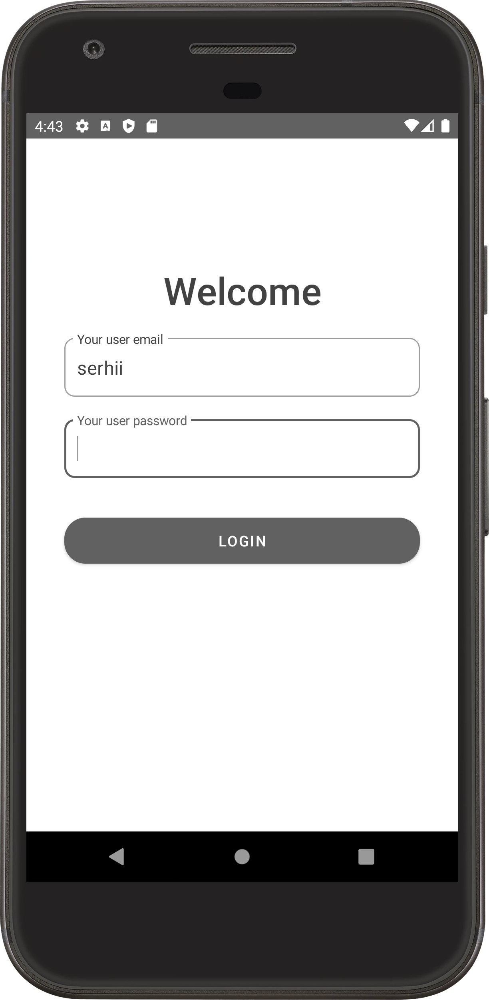
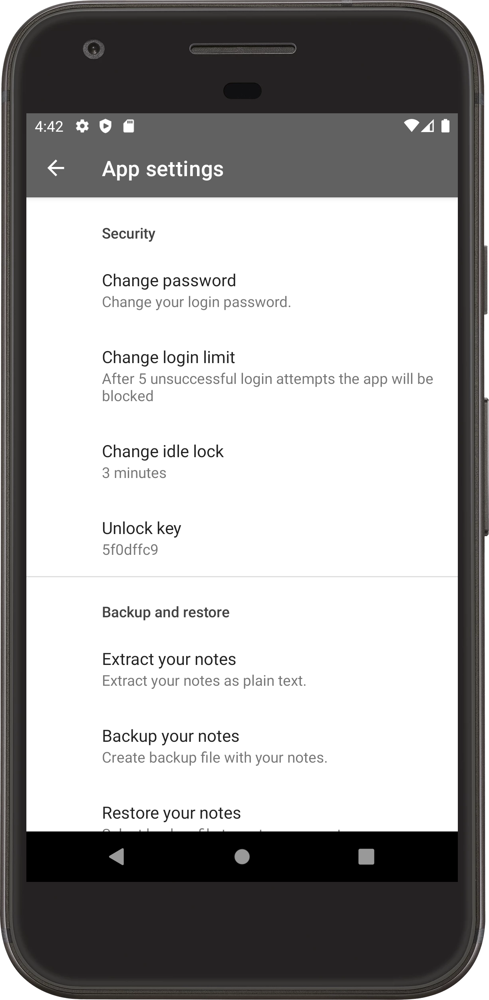

# Notes application for Android

# Overview

This application is developed for keeping and accessing all your notes securely on a device. 
The app encryptes your notes before saving it to storage. So, it couldn't be extracted and read easily. The app protects data with authentication
and it provides simple interface for use.

# Features

- Password and biometric authentication
- Basic text editing
- Limitation of user login attempts
- Application inactivity lock (idle lock timeout)
- Application block (after login attempts are exceeded)
- Secure information storage
- Backup/restore support

# Repository structure

- external-libs/ - project libraries folder
- Notes/ - project root folder

# Used technologies

- Languages: Java/JNI, C++17
- Libraries: OpenSSL (1.1.1v), Boost
- Build tools: NDK, Gradle
- Android conponents / libraries: fragments, view model, view binding, SQL database.

# Supported platforms

- Android version: Android 8 - Android 13
- Supported ABIs: x86, x86_64, armeabi-v7a

# Build instraction

Required tools:

1) NDK verions: 21.4.7075529
2) Java version: 11

Use gradlew or Android Studio ('Build' menu) to build this application

# App designs

 
  
 
 

# Contacts

Reach out to me for questions, help or collaboration - sergeybutr@gmail.com.