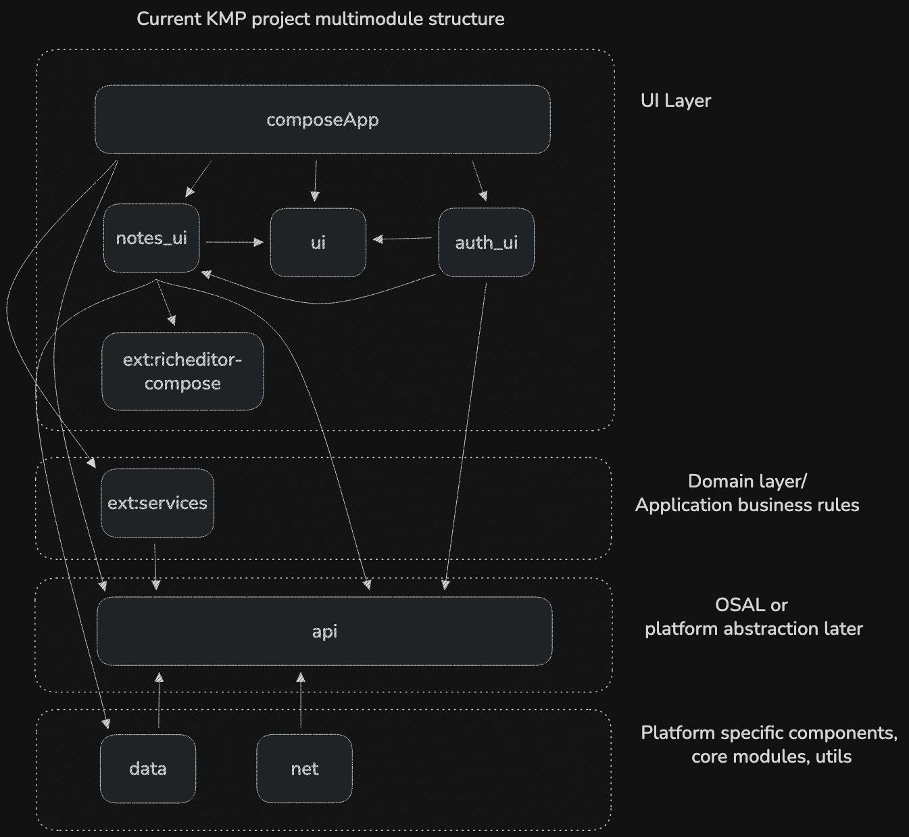

# Notes application 💜💜💜


# What is it ? ✨

Cross-platform, secure, fluent and rich editor for your notes, which is built with KMP.

# Current state

Under active development.

# Design



# Docs/Dev notes

**Cloning with submodules**

```
$ git clone /url/to/repo/with/submodules
$ git submodule init
$ git submodule update

Add new submodule:

$ git submodule add https://bitbucket.org/jaredw/awesomelibrary
```

**Declaring IOS targets**

```
listOf(
iosX64(),
iosArm64(),
iosSimulatorArm64(),
).forEach { iosTarget ->
iosTarget.binaries.framework {
baseName = "Shared"
isStatic = true
}
}
```

** Others

```
 1. Ktlint run:
 ./gradlew ktlintchec

 2. Android lint run:
 ./gradlew lint

 3. Fix style Ktlint issues:
 ./gradlew ktlintFormat

4. Fresh detekt run:
./gradlew detekt

This may be required:
./gradlew detektGenerateConfig
./gradlew detektBaseline
```

**The ongoing TODO list**

1. Investigate Android proguard settings:

```
kotlin { androidLibrary { ...
   optimization {
   // TODO: Might need to set proguard rules here
   }
...
```

2. Enable kotlin android lint 

**The ongoing improvements/features**

1. Add html to pdf export feature

Need to use WebView or native canvas drawing. No other approaches so far.

2. Add back button on Editor UI screen

3. Adjust colors for Dark mode

4. Investigate memory issues during runtime

5. Support backup
