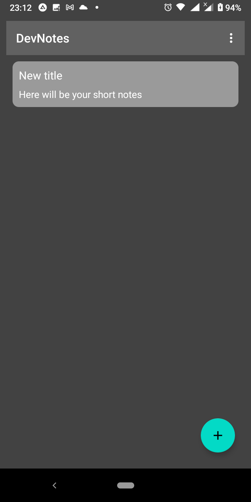

# Notes

# Overview

This application is developed for keeping and accessing all your information in a device securily. 
The app saves notes as encrypted data. So, it couldn't be extracted and read easily. The app protects data with authorization. 
The interface is simple and easy.

# Features

- Password and biometric authentication
- Basic text editing
- User login limitation
- Application inactivity lock
- Apllication block
- Secure information storage
- Backup support

# Repository structure

- external-libs/ - project libraries folder
- Notes/ - project root folder

# Used technologies

- Languages: Java/JNI, C++17
- Libraries: OpenSSL, Boost
- Build tools: NDK, Gradle
- Android conponents: fragments, view model, view binding, SQL database. 

# Screenshots

 
  
 
