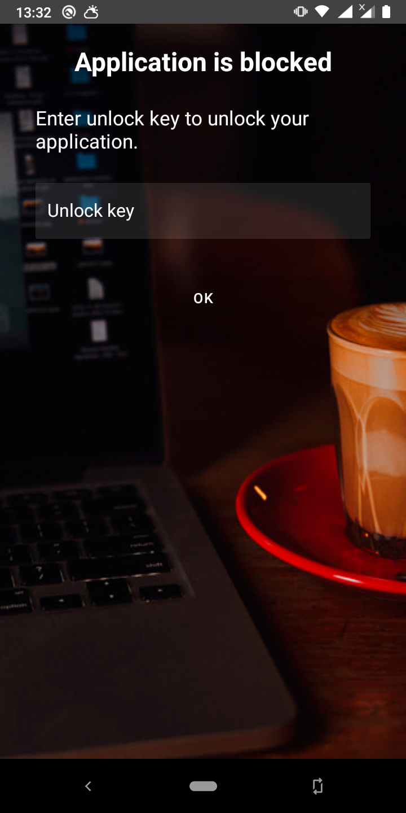

# Notes application for Android

# Overview

This application is developed for keeping and accessing all your notes on a device securely. 
The app encryptes your notes before saving it to storage. So, it couldn't be extracted and read easily. The app protects data with authentication. 
The interface is simple to use.

# Features

- Password and biometric authentication
- Basic text editing
- Limitation of User login attempts
- Application inactivity lock
- Apllication block (after login attempts are exceeded)
- Secure information storage
- Backup/restore support

# Repository structure

- external-libs/ - project libraries folder
- Notes/ - project root folder

# Used technologies

- Languages: Java/JNI, C++17
- Libraries: OpenSSL, Boost
- Build tools: NDK, Gradle
- Android conponents / libraries: fragments, view model, view binding, SQL database.

# Screenshots

 
  
 