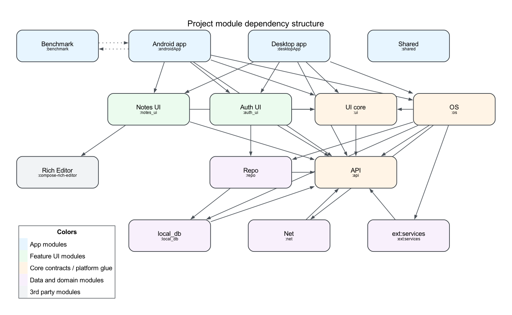

[](https://github.com/SerhiiButryk/Notes/actions)

# Notes application 💜💜💜


# What is it ? ✨

Cross-platform, secure, fluent and rich editor for your notes, which is built with KMP.

# Current state

Under active development.

# Design



**Cloning the repo with submodules**

```
$ git clone /url/to/repo/with/submodules
$ git submodule init
$ git submodule update

Add new submodule:

$ git submodule add https://bitbucket.org/jaredw/awesomelibrary
```

**Dev notes**

```
 1. Ktlint run:
 ./gradlew ktlintchec

 2. Android lint run:
 ./gradlew lint

 3. Fix style Ktlint issues:
 ./gradlew ktlintFormat

4. Fresh detekt run:
./gradlew detekt

This may be required:
./gradlew detektGenerateConfig
./gradlew detektBaseline
```

**The ongoing improvements/features**

1. Investigate memory issues during runtime

2. Test with large notes > 1 GB

3. Implement sign out 

4. Implement UI improvements (Search, Labels ...)
