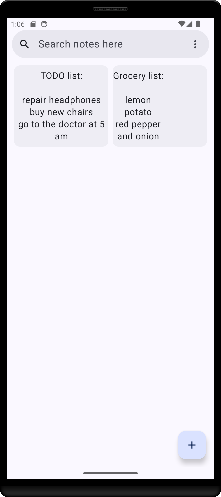
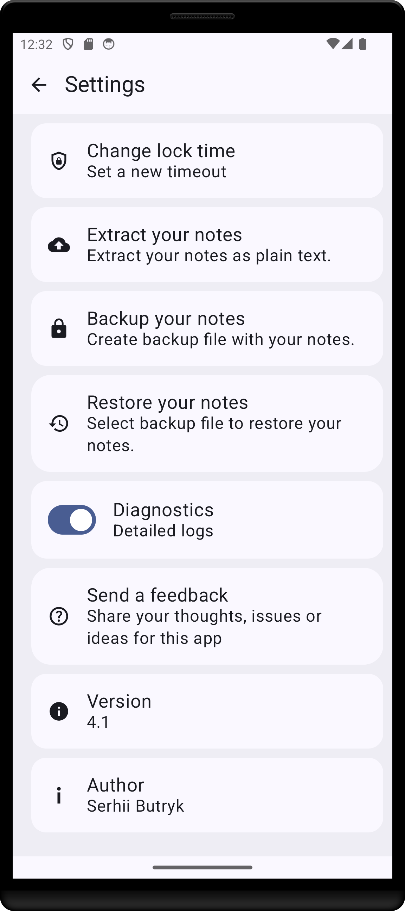

# Notes application for Android

# Overview

This application is developed for keeping and accessing all your notes securely on a device. 
The app encryptes your notes before saving it to storage. So, it couldn't be extracted and read easily. The app protects data with authentication
Also it provides simple and beautiful interface.

# Get on Google Play

# Features

- User authentication
- Basic text edit
- Application idle lock (UI app screen lock after a timeout)
- Secure data storage
- Backup/restore support
- A search across all your notes

# Repository structure

- external-libs/ - additinal libraries which the app is using
- Notes/ - the app project folder
- tools/ - utility scripts
- gradle_configs/ - utility project gradle settings

# Used technologies

- Languages: Kotlin, JNI, C++17

- Libraries: 

1) OpenSSL (1.1.1v) - https://www.openssl.org/source/
2) Boost - https://www.boost.org/ 
3) CSCRYPTO - https://www.copperspice.com/docs/cs_crypto/basic_what.html

- Build tools: NDK, Gradle
- Android conponents/libraries: Jatpack Compose, Fragments, ViewModel, SQL database.

# Supported platforms

- Android OS: Android 8 - Android 14
- ABIs: x86, x86_64, armeabi-v7a, arm64-v8a

# Localization

- ua (Ukraine)
- ru (Russia)
- uk (English)

# Build instructions

Required tools:

1) NDK verions: 26
2) Java version: 17
2) Kotlin version: 2.0

Use gradlew or Android Studio 'Build' menu to build this project

# Unit Tests

Find tests under 'Notes/app/src/androidTest' folder.

# App designs [This is not up-to-date]

 
  
 
 

# Questions or help

Reach out to me: sergeybutr@gmail.com.